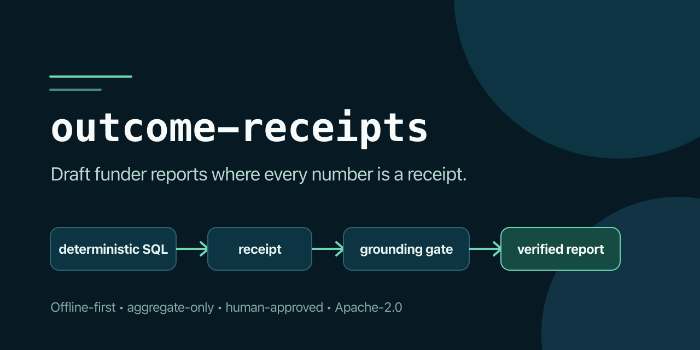

# outcome-receipts

[](https://github.com/ChelseaKR/outcome-receipts/actions/workflows/ci.yml)
[](https://www.python.org/downloads/)
[](LICENSE)



Draft funder outcome reports where **every number is a receipt**. The tool reads
a nonprofit's own service data, computes each required figure with a deterministic
query, and attaches to that figure a receipt: the exact query, the count of rows
it drew from, a content hash of that data slice, and a timestamp. It then drafts
a narrative around the receipted figures and runs fail-closed grounding gates
before and after suppression. Export is refused if any displayed number does not
trace to a receipt.

> **Status: Beta, unreleased.** The default path is deterministic, offline, and
> tested end to end. Current `main` also includes the completed privacy,
> verification, mapping, localization, multi-template, reconciliation, and
> optional Bedrock-drafting roadmap work. Bedrock is off by default and requires
> two explicit opt-ins. A committed eval ([eval/report.md](eval/report.md)) scores
> the grounding gate. No version has been tagged or published yet; see
> [CHANGELOG.md](CHANGELOG.md) and [SECURITY.md](SECURITY.md#supported-versions).
>
> *Last verified: 2026-07-11 · Recheck: quarterly*

**Start here:** [run the five-minute synthetic demo](docs/TRY_THE_DEMO.md),
[inspect the current evaluation](eval/report.md), or
[bring an anonymized schema-mapping question](https://github.com/ChelseaKR/outcome-receipts/issues/new?template=schema-mapping.yml).

## The problem

Funders are starting to reject reports that are "substantially AI-developed,"
because a language model that writes plausible outcome numbers is a liability, not
a help. The fix is not to ban the model; it is to make the numbers come from the
data and prove it. The verify-or-flag idea is published, and one commercial tool
markets deterministic record-cited reporting. The contribution here is the open,
offline chain — compute with a receipt, draft, fail-closed grounding gate, export
with a receipts manifest — plus a fail-closed review queue for mapping explicit
requirements onto schema-variant exports, and a privacy posture (aggregate,
small-cell-aware) a human-services org can defend.

## How it works

```text
compute → draft → ground → suppress → re-draft/re-ground → approve → export
```

1. **Compute with receipts.** Author-declared data checks run first. Service data
   is then loaded into an in-memory SQLite database and every metric is computed
   by SQL. Each figure carries the query, row count, slice hash, value, definition,
   and timestamp that produced it.
2. **Draft and ground the raw result.** The deterministic drafter fills
   `{metric_id}` placeholders. If the optional Bedrock drafter is enabled, it may
   rewrite the prose but receives no source rows, identifiers, SQL, hashes, or
   paths. Every numeric span must match a receipted display exactly.
3. **Apply the privacy boundary.** Counts from 1 through 10 are suppressed under
   the CMS-modeled default. Complementary, delta, and percentage controls prevent
   straightforward arithmetic recovery; true zeros remain visible. Every
   publishable surface is rebuilt from the redacted figures.
4. **Ground again and approve.** The redacted narrative, charts, comparison, and
   reconciliation views pass the same fail-closed gate. A named human then signs
   off on the final artifact.
5. **Export and seal.** The report, receipts manifest, trace view, charts, bundle
   manifest, and hash-chained ledger entry are written. Optional keyed signing
   seals the bundle; verification commands detect later drift or tampering.

The load-bearing invariant is unchanged: **numbers never come from a model.** A
model may write prose only when explicitly enabled, and any numeric invention or
alteration blocks export.

## Usage

Prerequisites: Python 3.12, [uv](https://docs.astral.sh/uv/), GNU Make, and a
clone of this repository. Install the locked development environment and activate
it:

```sh
make install
source .venv/bin/activate
```

`make install` creates `.venv`; it does not modify the parent shell's `PATH`.
You can use `.venv/bin/receipts` instead of activating it.

Run the bundled demo:

```sh
receipts run --config examples/housing-demo/report.toml --out out --approved-by "A. Reviewer"
```

```text
loaded examples/housing-demo/services.csv: 12 rows, 5 columns, digest b8b5e05adefaa26f
figures computed: 4
chart and comparison numbers: 0 (bound 0, unbound 0)
numbers in 'report' narrative: 1 (bound 1, unbound 0)
suppression policy: applied (threshold 11; hidden 3)

grounding gate: PASS
  approved: A. Reviewer
  report:   out/report.md
  receipts: out/receipts.json
  trace:    out/trace.html
  bundle:   out/bundle.json (digests-only)
  ledger:   export-ledger.jsonl (entry 0, hash …)
```

It writes `out/report.md` (the narrative, provenance, and receipts appendix),
`out/receipts.json` (machine-readable receipts and provenance), `out/trace.html`
(a funder-facing trace view), and `out/bundle.json` (digests for the complete
export). Runs also append to `export-ledger.jsonl` by default. Specs with charts
add accessible SVG files under `out/charts/`.

An export also needs a named human sign-off. `--approved-by NAME` records the
approver non-interactively; without it, an interactive run prompts you to type
your name after the grounding gate passes, and a non-interactive run aborts with
exit code 3 and writes nothing. The approver and the approval time are recorded
in the provenance statement of the report and in the receipts manifest
(`provenance.approved_by`, `provenance.approved_at`; `approved_by` is `null`
when nothing was approved, which no export should ever carry).

### Minimal report specification

A report spec identifies the CSV, narrative template, and deterministic query for
each placeholder. Paths resolve relative to the TOML file.

```toml
[data]
path = "services.csv"

[report]
title = "Housing outcome report"
template = "We served {clients_served} clients."

[metrics.clients_served]
description = "Unduplicated clients served"
definition = "Distinct clients with an enrollment in the reporting export."
kind = "output"
unit = "count"
value_sql = "SELECT COUNT(DISTINCT client_id) FROM data"
slice_sql = "SELECT client_id FROM data"
```

See [examples/housing-demo/report.toml](examples/housing-demo/report.toml) for a
complete spec and `receipts init --data services.csv --out report.toml` for a
fail-loud starter containing the source-column inventory.

### Privacy defaults

Exports are structurally aggregate-only: source client rows never enter a report
renderer. The default suppression policy is modeled on CMS guidance: count cells
from 1 through 10 are redacted, true zeros are preserved, and complementary
suppression closes arithmetic recovery paths through totals, deltas, and
percentages. HUD requires anonymous aggregate publication but does not prescribe
this numeric floor, so the policy governing a particular report remains the
operator's responsibility. See the [data card](docs/DATA-CARD.md) and suppression
ADRs in [docs/decisions](docs/decisions/).

Check a narrative against the receipts at any time:

```sh
receipts audit --config examples/housing-demo/report.toml --narrative some-draft.md
```

If the narrative contains a number that no figure backs, `audit` reports it and
exits non-zero, and `run` refuses to export.

### Templates, charts, comparison, and reconciliation

A report type is defined entirely by its TOML spec, so adding a report shape means
adding a spec. Two more ship alongside the housing demo: a grant report and a
board report.

```sh
receipts run --config examples/grant-report/report.toml --out out/grant --approved-by "A. Reviewer"
receipts run --config examples/board-report/report.toml --out out/board --approved-by "A. Reviewer"
```

The same receipted figure set can render into several `[[report.templates]]`
formats for different funders. Optional charts, comparisons, and board
reconciliations are held to the same gate as every narrative:

* **Charts.** A `[[charts]]` entry names the figures it draws. The chart's bars or
  points are those figures' values, so a chart has no data of its own; it is a
  rendering of numbers that already carry receipts. Each chart is written as a
  standalone SVG and paired with an accessible data table that carries the same
  numbers as text, so a chart is readable without the image and every number in it
  traces to a receipt. The SVG is built with the standard library, so no
  dependency is added.
* **Period comparison.** A `[comparison]` section runs one set of metrics across
  two periods (for example two quarters) and reports the change. The two period
  values and the change are each a figure with a receipt; the change is computed
  by a single SQL query that subtracts one period from the other, not by
  arithmetic on the page. Direction is reported as a word, so no ungrounded number
  is shown.
* **Board reconciliation.** A `[reconciliation]` section pairs receipted outcome
  figures with receipted financial lines over the same periods, including a
  grounded change log. No displayed ratio or delta is computed only on the page.
* **Multi-funder output.** Each `[[report.templates]]` entry gets its own output
  directory, report, manifest, trace, bundle, and ledger entry while reusing the
  same byte-identical figure set.

`receipts run` grounds all narrative and structured claims before and after
suppression and refuses to export if any number is unbound.

Score the gate on the committed fixtures:

```sh
receipts eval --config examples/housing-demo/report.toml
```

The committed result is in [eval/report.md](eval/report.md): the drafted
narrative grounds 100% of its numbers, so the gate passes. That the gate catches
an injected unverifiable number is shown by the merge-blocking test
`tests/test_grounding_gate.py`.

### English and Spanish report output

Public report copy, approval language, reconciliation labels, chart alternative
text, receipt metadata labels, and trace-view content are available in English
and Spanish. Figures, SQL, hashes, and source data do not change across locales.

```sh
receipts run --config examples/housing-demo/report.toml --out out/es \
  --locale es --approved-by "A. Reviewer"
```

The CLI's operational messages remain English. See [docs/I18N.md](docs/I18N.md).

### Optional Claude-on-Bedrock drafting

The deterministic drafter remains the zero-cloud default. Bedrock drafting needs
the optional dependency, an enabled `[report.drafting]` policy with a model ID,
and `--allow-cloud-drafting` on every run:

```sh
uv sync --frozen --python 3.12 --group dev --extra bedrock
receipts run --config report.toml --out out --allow-cloud-drafting \
  --approved-by "A. Reviewer"
```

The first model request may contain small aggregate displays even though the
published artifact is subsequently suppressed. Organizations must explicitly
authorize that transfer and configure their Bedrock logging and retention policy.
See [docs/drafting.md](docs/drafting.md), the [model card](docs/MODEL-CARD.md),
and the [data card](docs/DATA-CARD.md).

### The trace view, the provenance statement, and re-derivation

Three things make the proof legible and checkable for the people who receive a
report, none of which puts a model near a number.

* **A definition on every metric.** A figure is only as fair as its definition, so
  a metric can carry a plain-language `definition` (what window, who counts, the
  deduplication rule). It rides in the receipt and renders next to the figure, so a
  reviewer can see and contest the choice a query encodes without reading SQL.
* **A trace view** (`out/trace.html`). The receipts manifest is JSON, which a grant
  manager or program officer cannot read. The trace view renders the same receipts
  as one self-contained, accessible HTML page: a summary table of every figure with
  its value and definition, then the receipt behind each (the query, the row count,
  the slice hash, the timestamp). It opens offline and needs no SQL or Python.
* **A provenance statement.** Every export embeds a short, standard block stating
  that each number was computed by a deterministic query, that no figure was
  written by a model, and that the grounding gate bound every number before export.
  The same attestation goes into the manifest as a machine-readable record, which
  separately names the deterministic or Bedrock narrative drafter used.

Re-derive a committed report to confirm it still holds:

```sh
receipts run --config examples/grant-report/report.toml --out out/grant --approved-by "A. Reviewer"
receipts verify --config examples/grant-report/report.toml --receipts out/grant/receipts.json
```

`receipts verify` recomputes every figure from the spec and the cited data and
checks each value, slice hash, row count, and query against the manifest. A
mismatch is drift (the data changed, the spec changed, or the manifest was edited);
verify reports each drifted receipt and exits non-zero, so a silent divergence
cannot pass.

The same check is packaged as a reusable composite GitHub Action so a downstream
repo can gate CI on receipt drift with a commit-pinned action ref. See
[docs/ci-action.md](docs/ci-action.md) for the workflow snippet and supply-chain
pinning guidance.

### Command guide

| Command | Purpose |
| --- | --- |
| `receipts init` | Inspect a CSV header and create an empty, fail-loud starter spec. |
| `receipts map` | Map explicit funder requirements to candidate SQL and emit a mandatory human review queue; see [metric mapping](docs/metric-mapping.md). |
| `receipts run` | Compute, ground, suppress, approve, export, seal, and append to the ledger. |
| `receipts audit` | Check an existing narrative for numeric spans that do not bind to receipts. |
| `receipts eval` | Score grounding behavior on a configured fixture. |
| `receipts verify` | Recompute receipt values and hashes, or verify an entire exported bundle with `--bundle`. |
| `receipts verify-bundle` | Recompute `bundle.json` member digests and an optional keyed signature. |
| `receipts verify-ledger` | Re-hash the append-only export ledger and detect a broken chain. |
| `receipts diff` | Explain added, removed, or changed figures between two manifests. |
| `receipts cards` | Generate or drift-check the model and data cards. |

Run `receipts <command> --help` for the complete option reference. Every command
supports `--json` before or after the subcommand.

### CLI output and exit codes

Every command prints human-readable lines by default. Pass `--json` to any command
to get a single machine-readable JSON object on stdout instead, with the prose
suppressed. The JSON is purely presentational; it never changes the exit code.

```sh
receipts run --config examples/housing-demo/report.toml --out out --reproducible --approved-by CI --json
receipts verify --config examples/grant-report/report.toml --receipts out/grant/receipts.json --json
receipts map --data examples/housing-demo/services.csv --requirements examples/mapping/requirements.json --out mapping-review.json --json
```

The `run` object reports the gate result, figure and narrative tallies, any
unbound numbers, the paths it wrote, the export-ledger entry it appended, and the
recorded approval. Under `--json` there is no interactive sign-off prompt, so
`run` needs `--approved-by`; without it the export aborts with exit code 3 and a
`null` approval in the payload. The `audit`, `verify`, `verify-bundle`,
`verify-ledger`, `eval`, `diff`, and `cards` objects report their own results and
details; `map` reports pending or blocked candidates without executing them;
`init` carries the scaffolded spec and where it was written. The `--json` flag is
accepted before or after the subcommand, so `receipts --json run ...` and
`receipts run ... --json` are equivalent.

The exit code is the contract a script should read. It is stable across the human
and JSON forms.

| Code | Meaning |
| ---- | ------- |
| 0 | Success. The command ran and the grounding gate, where one applies, passed. |
| 1 | A check failed closed: mapping was blocked, grounding/eval failed, receipts or a bundle drifted, a ledger chain broke, or generated cards were stale. |
| 2 | The grounding gate refused to export. `run` found an unbound number and wrote nothing. |
| 3 | The export was not approved. The grounding gate passed but no named human signed off (no `--approved-by`, and no interactive sign-off), so `run` wrote nothing. |

## What it does not do

* It does **not let a model invent numbers.** Figures come from queries; the gate
  enforces it.
* It is **not a data warehouse or a BI tool.** It computes the figures a report
  needs and proves them, then gets out of the way.
* It does **not claim a new verification primitive.** The verify-or-flag idea is
  published; the contribution is the open offline chain, the metric-mapping, and
  the privacy posture.

## Standards conformance

This repo holds itself to the portfolio's shared engineering standards. The
project-specific values live in [docs/ROADMAP.md](docs/ROADMAP.md) and
[docs/RESPONSIBLE-TECH-AUDITS.md](docs/RESPONSIBLE-TECH-AUDITS.md).

| Standard | State |
|----------|-------|
| Responsible-Tech Framework | Applies — see docs/RESPONSIBLE-TECH-AUDITS.md |
| Code Quality | Applies — ruff, mypy --strict, pytest, merge-blocking |
| Documentation | Applies |
| Quality & Metrics | Applies — committed eval with Wilson CIs, fail-closed gate |
| AI Evaluation | Applies only to the optional Bedrock drafting seam; numeric invention is merge-blocked, while a future model judge requires human-label calibration before use |
| Security & Supply-Chain | Applies — SHA-pinned actions, least-privilege tokens, CycloneDX SBOM, Sigstore-signed build provenance, plus pip-audit, osv-scanner, gitleaks, zizmor, and Semgrep in CI. Open: CodeQL and OpenSSF Scorecard. |
| CI/CD | Applies — `make verify` mirrors CI; `release.yml` re-runs it at the tagged commit before signing or publishing |
| Accessibility | Applies to the chart output and the trace view — every chart ships an SVG with `role="img"`, `<title>`, and `<desc>` paired with an equivalent data table, and the trace-view HTML is semantic and high-contrast (one `<h1>`, `lang` set, table headers with `scope`, a `<caption>`); `ci.yml`'s `accessibility` job runs pa11y (WCAG2AA) against the built trace view; the CLI core stays headless |
| Internationalization | Applies — public report and trace output have EN/ES parity; operational CLI messages remain English. See [docs/I18N.md](docs/I18N.md). |
| Observability | N/A — library/CLI, no long-running service |
| Release & Versioning | Applies — tag-triggered release with SBOM + Sigstore attestation; PyPI Trusted Publishing; first tag pending (no version has shipped yet, see CHANGELOG.md) |

## For Claude Code

Read [CLAUDE.md](CLAUDE.md) first. It is the source of truth for scope,
conventions, and the build plan, and it states the hard guardrails: numbers never
come from the model, the grounding gate is fail-closed, small-cell suppression is
a privacy invariant, and the honest framing of what is solved art versus the
contribution. Then read [docs/ROADMAP.md](docs/ROADMAP.md) for the delivered
architecture and future release gates; it is no longer an open implementation
backlog.

## License

Apache-2.0.

## Project discussion

Use [GitHub Discussions](https://github.com/ChelseaKR/outcome-receipts/discussions)
for setup and design questions. Use the structured issue forms to
[report a demo run](https://github.com/ChelseaKR/outcome-receipts/issues/new?template=demo-run.yml)
or [describe a mapping question](https://github.com/ChelseaKR/outcome-receipts/issues/new?template=schema-mapping.yml).
Never post client-level rows, identifiers, credentials, or real service exports.
